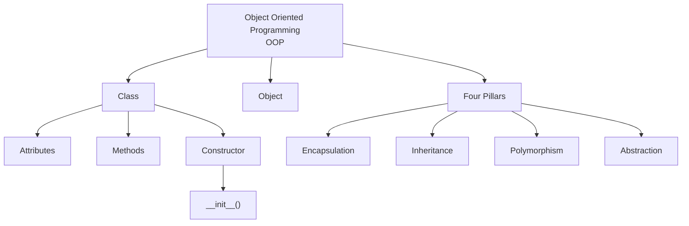

## OOP Main Concepts

```mermaid
flowchart TD
    A["Object Oriented Programming<br/>OOP"]

    A --> B["Class"]
    A --> C["Object"]

    B --> D["Attributes"]
    B --> E["Methods"]
    B --> F["Constructor"]

    F --> G["__init__()"]

    A --> H["Four Pillars"]

    H --> I["Encapsulation"]
    H --> J["Inheritance"]
    H --> K["Polymorphism"]
    H --> L["Abstraction"]
```