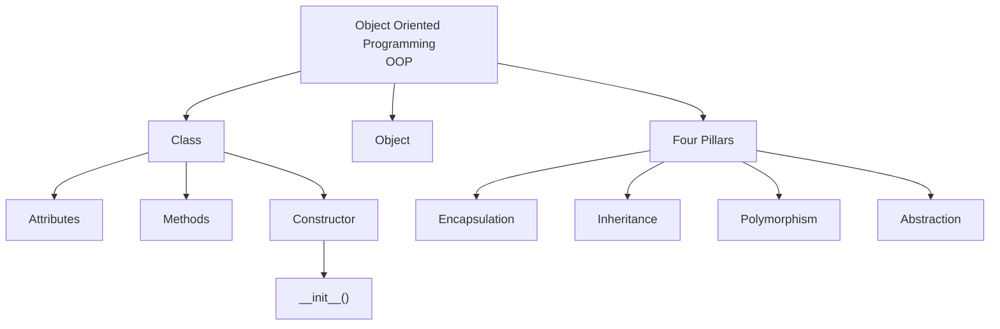

## OOP Main Concepts



# Python OOP — Zero to Professional Theory

> A step-by-step theory guide to Object-Oriented Programming (OOP) in Python, from fundamentals to real-world application architecture.

---

## Table of Contents

1. [Why OOP?](#1-why-oop)
2. [Class & Object](#2-class--object)
3. [`__init__()` and `self`](#3-__init__-and-self)
4. [Instance Variables & Methods](#4-instance-variables--methods)
5. [Multiple Objects](#5-multiple-objects)
6. [Class Variables & Class Methods](#6-class-variables--class-methods)
7. [Static Methods](#7-static-methods)
8. [Encapsulation](#8-encapsulation)
9. [Inheritance](#9-inheritance)
10. [Method Overriding](#10-method-overriding)
11. [`super()`](#11-super)
12. [Polymorphism](#12-polymorphism)
13. [Composition](#13-composition)
14. [Abstract Classes](#14-abstract-classes)
15. [Magic / Dunder Methods](#15-magic--dunder-methods)
16. [Dataclasses](#16-dataclasses)
17. [Exception Handling with OOP](#17-exception-handling-with-oop)
18. [OOP with Files / Databases](#18-oop-with-files--databases)
19. [OOP with FastAPI](#19-oop-with-fastapi)
20. [The Four Core OOP Principles](#the-four-core-oop-principles)
21. [Complete OOP Mental Map](#complete-oop-mental-map)
22. [Important Professional Perspective](#important-professional-perspective)

---

# Python OOP — Zero to Professional Theory

## What is OOP?

**OOP = Object-Oriented Programming.**

OOP is a programming approach where software is designed around **objects**.

An object combines:

- **Data** — what the object knows
- **Behavior** — what the object can do

For example, a bank account can have:

### Data
- Account number
- Customer name
- Balance

### Behavior
- Deposit
- Withdraw
- Check balance

Instead of keeping these separately, OOP allows us to represent them as one logical unit: a `BankAccount` object.

### Fundamental idea

> **OOP helps us model related data and behavior together.**

OOP is not automatically better than procedural programming. For small scripts, simple functions may be more appropriate. OOP becomes especially useful when an application contains entities, state, behavior, relationships, and growing complexity.

---

# 1. Why OOP?

Before learning classes, understand the problem OOP is trying to solve.

Suppose we build a small bank program without classes:

```python
customer1_name = "Karthik"
customer1_balance = 10000

customer2_name = "Rahul"
customer2_balance = 5000
```

We can create functions:

```python
def deposit(balance, amount):
    return balance + amount

def withdraw(balance, amount):
    return balance - amount
```

Then:

```python
customer1_balance = deposit(customer1_balance, 2000)
customer2_balance = withdraw(customer2_balance, 1000)
```

This works.

## So what is the problem?

As the application grows, we may have:

```text
Customer
Account
Address
Transaction
Loan
Payment
Employee
Product
Order
```

We end up managing large numbers of variables and functions.

The code becomes harder to organize because the **data and the operations belonging to that data are separated**.

OOP gives us a way to group them.

Conceptually:

```text
BankAccount
│
├── Data
│   ├── account_number
│   ├── customer_name
│   └── balance
│
└── Behavior
    ├── deposit()
    ├── withdraw()
    └── check_balance()
```

### Important principle

> **OOP helps us organize related data and behavior into reusable objects.**

---

# 2. Class & Object

These are the two most fundamental OOP concepts.

## Class

A **class is a blueprint or template** for creating objects.

```python
class Student:
    pass
```

This defines a type called `Student`.

It does not yet create a student object.

## Object

An **object is an actual instance of a class**.

```python
student1 = Student()
```

Now:

```text
Student class
      ↓
  student1 object
```

We can create multiple objects from one class:

```python
student1 = Student()
student2 = Student()
student3 = Student()
```

Conceptually:

```text
              Student class
                   │
        ┌──────────┼──────────┐
        ↓          ↓          ↓
    student1    student2    student3
```

Each object is a separate instance.

### Real-world analogy

Think of a class as a **car design**.

The actual cars produced from that design are objects.

```text
Class  → Car design
Object → My car
Object → Your car
Object → Another car
```

---

# 3. `__init__()` and `self`

Now we need to give objects data.

```python
class Student:

    def __init__(self, name, age):
        self.name = name
        self.age = age
```

Create an object:

```python
student1 = Student("Karthik", 23)
```

## What is `__init__()`?

`__init__()` is an **initializer method**.

It runs when an object is initialized.

For example:

```python
student1 = Student("Karthik", 23)
```

Conceptually, Python invokes the initializer with the newly created object and the supplied values.

The important idea is:

> `__init__()` is used to initialize an object's state.

---

## What is `self`?

`self` represents the **current object**.

Suppose:

```python
student1 = Student("Karthik", 23)
student2 = Student("Rahul", 24)
```

When Python is operating on `student1`:

```text
self → student1
```

When Python is operating on `student2`:

```text
self → student2
```

Therefore:

```python
self.name
```

means:

> The `name` belonging to the current object.

### Important

`self` is not a special keyword in the same sense as `class` or `def`. It is the conventional name Python programmers use for the instance parameter.

---

# 4. Instance Variables & Methods

## Instance Variable

An **instance variable** is data belonging to a particular object.

```python
class Student:

    def __init__(self, name, age):
        self.name = name
        self.age = age
```

Here:

```python
self.name
self.age
```

are instance attributes/variables.

Each object can have different values.

Conceptually:

```text
student1
├── name = Karthik
└── age = 23

student2
├── name = Rahul
└── age = 24
```

---

## Instance Method

An **instance method** is a function defined inside a class that normally operates on an instance.

```python
class Student:

    def __init__(self, name):
        self.name = name

    def introduce(self):
        print("My name is", self.name)
```

Usage:

```python
student1.introduce()
```

The method operates on `student1`.

### Basic terminology

| Concept | Example |
|---|---|
| Class | `Student` |
| Object | `student1` |
| Instance variable | `self.name` |
| Instance method | `introduce()` |
| Initializer | `__init__()` |
| Current object | `self` |

---

# 5. Multiple Objects

One class can create many objects.

```python
class Employee:

    def __init__(self, name, salary):
        self.name = name
        self.salary = salary
```

Create multiple objects:

```python
employee1 = Employee("Karthik", 50000)
employee2 = Employee("Rahul", 60000)
employee3 = Employee("Anita", 70000)
```

Each object normally has its own instance state:

```text
employee1
name   → Karthik
salary → 50000

employee2
name   → Rahul
salary → 60000

employee3
name   → Anita
salary → 70000
```

Changing one object's instance attribute does not normally change another object's corresponding attribute:

```python
employee1.salary = 55000
```

does not change:

```python
employee2.salary
```

because they are separate instances.

---

# 6. Class Variables & Class Methods

So far we have seen instance variables.

Now introduce **class variables**.

## Class Variable

A class variable is an attribute associated with the class rather than an individual instance.

```python
class Employee:

    company = "ABC Technologies"
```

Objects can access it:

```python
employee1 = Employee()
employee2 = Employee()

print(employee1.company)
print(employee2.company)
```

Both can access the class attribute.

Conceptually:

```text
Class Employee
│
└── company = "ABC Technologies"

employee1
└── individual instance state

employee2
└── individual instance state
```

### Instance variable vs class variable

```python
class Employee:

    company = "ABC Technologies"

    def __init__(self, name):
        self.name = name
```

Here:

- `self.name` → instance-specific
- `company` → class-level attribute

---

## Class Method

A class method operates on the class and receives `cls`.

Use:

```python
@classmethod
```

Example:

```python
class Employee:

    company = "ABC Technologies"

    @classmethod
    def change_company(cls, new_company):
        cls.company = new_company
```

Here:

```text
self → current instance
cls  → current class
```

A class method is useful when the operation needs to work with class-level state or provide an alternative way of constructing/operating on the class.

---

# 7. Static Methods

A static method does not automatically receive either:

- `self`
- `cls`

Example:

```python
class Calculator:

    @staticmethod
    def add(a, b):
        return a + b
```

Usage:

```python
Calculator.add(10, 20)
```

Why put it inside a class?

Because the operation can be logically related to the class while not requiring object or class state.

### Three common method types

| Method | First automatic argument | Works primarily with |
|---|---|---|
| Instance method | `self` | Instance/object |
| Class method | `cls` | Class |
| Static method | None | Neither instance nor class state |

Remember:

```text
Instance method → object behavior
Class method    → class-level behavior
Static method   → related utility behavior
```

---

# 8. Encapsulation

Encapsulation means **organizing internal state and controlling how that state is accessed or modified**.

Suppose:

```python
class BankAccount:

    def __init__(self, balance):
        self.balance = balance
```

Anyone can directly change:

```python
account.balance = -100000
```

If negative balances are not valid for this domain, unrestricted modification is a problem.

Encapsulation lets us put rules around state.

---

## `_name`

A single underscore:

```python
self._balance
```

is mainly a **convention**.

It communicates:

> "This attribute is intended for internal/protected use."

Python does not strictly prevent access.

You can still write:

```python
account._balance
```

---

## `__name`

Double leading underscores:

```python
self.__balance
```

trigger **name mangling**.

Python internally changes the attribute name to reduce accidental name collisions and accidental direct access, especially in inheritance scenarios.

It is not absolute private access.

---

## Properties

A property allows an attribute-like interface while executing logic behind the scenes.

```python
class BankAccount:

    def __init__(self, balance):
        self._balance = balance

    @property
    def balance(self):
        return self._balance
```

Now:

```python
account.balance
```

looks like normal attribute access.

You can also define a setter:

```python
@balance.setter
def balance(self, value):
    if value < 0:
        raise ValueError("Balance cannot be negative")

    self._balance = value
```

Now:

```python
account.balance = 5000
```

is valid.

But:

```python
account.balance = -5000
```

raises an error.

### Core idea

Encapsulation is not simply:

> "Make variables private."

A better understanding is:

> **Control access to an object's internal state and protect the rules that must always remain true.**

---

# 9. Inheritance

Inheritance allows one class to derive from another class.

Example:

```text
Vehicle
   │
   ├── Car
   └── Bike
```

A `Car` is a type of `Vehicle`.

```python
class Vehicle:

    def move(self):
        print("Vehicle is moving")
```

```python
class Car(Vehicle):
    pass
```

Now:

```python
car = Car()
car.move()
```

`Car` inherits `move()` from `Vehicle`.

### Terminology

```python
class Vehicle:
    pass
```

`Vehicle` is the:

- Parent class
- Base class
- Superclass

```python
class Car(Vehicle):
    pass
```

`Car` is the:

- Child class
- Derived class
- Subclass

---

# 10. Method Overriding

A child class can provide its own implementation of a method inherited from the parent.

```python
class Vehicle:

    def move(self):
        print("Vehicle is moving")
```

```python
class Car(Vehicle):

    def move(self):
        print("Car is driving")
```

Now:

```python
car = Car()
car.move()
```

Output:

```text
Car is driving
```

The child implementation **overrides** the inherited implementation.

Method overriding is important when a child type needs behavior specialized for itself.

---

# 11. `super()`

Sometimes a child class wants to reuse functionality from its parent.

Example:

```python
class Vehicle:

    def __init__(self, brand):
        self.brand = brand
```

```python
class Car(Vehicle):

    def __init__(self, brand, model):
        super().__init__(brand)
        self.model = model
```

Here:

```python
super().__init__(brand)
```

calls the appropriate parent implementation of `__init__()` in this inheritance hierarchy.

The child then adds:

```python
self.model = model
```

### Core idea

Think of `super()` as:

> **Access the next implementation in the inheritance hierarchy.**

It becomes especially important when working with inheritance chains and multiple inheritance.

---

# 12. Polymorphism

**Poly** = many  
**Morph** = forms

Polymorphism means that the same operation/interface can work with different types of objects.

Example:

```python
class Dog:

    def speak(self):
        print("Bark")
```

```python
class Cat:

    def speak(self):
        print("Meow")
```

Now:

```python
def make_sound(animal):
    animal.speak()
```

We can call:

```python
make_sound(Dog())
make_sound(Cat())
```

The same function works with different objects.

Conceptually:

```text
make_sound()
    │
    ├── Dog  → Bark
    └── Cat  → Meow
```

The function does not need to know the exact concrete class.

---

## Duck Typing

Python strongly supports **duck typing**.

The common idea is:

> "If it behaves like the required type, it can be used in that context."

Python often focuses on:

```text
What can this object do?
```

rather than only:

```text
What exact class is this?
```

This is a major part of idiomatic Python.

---

# 13. Composition

Composition means:

> **An object contains or uses another object.**

Consider:

```text
Car HAS-A Engine
```

rather than:

```text
Car IS-A Vehicle
```

Example:

```python
class Engine:

    def start(self):
        print("Engine started")
```

```python
class Car:

    def __init__(self):
        self.engine = Engine()
```

Now:

```python
car = Car()
car.engine.start()
```

Conceptually:

```text
Car
 │
 └── Engine object
```

This is composition.

---

## Inheritance vs Composition

Inheritance:

```text
Car IS-A Vehicle
```

Composition:

```text
Car HAS-A Engine
```

A useful design principle is:

> **Prefer composition over inheritance when the relationship is not genuinely "is-a".**

Do not use inheritance merely because it provides code reuse.

---

# 14. Abstract Classes

Sometimes you want a base class to define a common contract without providing a complete implementation.

Python provides the `abc` module.

```python
from abc import ABC, abstractmethod
```

Example:

```python
class Payment(ABC):

    @abstractmethod
    def pay(self, amount):
        pass
```

Now concrete classes can implement the contract:

```python
class CreditCardPayment(Payment):

    def pay(self, amount):
        print("Paid using credit card")
```

```python
class UPIPayment(Payment):

    def pay(self, amount):
        print("Paid using UPI")
```

The abstract class defines the contract:

```text
Every Payment must provide:
    pay()
```

The subclasses decide how the operation is implemented.

### Why abstraction?

Abstraction lets application code depend on **what an object can do** rather than the details of how a particular implementation does it.

For example:

```text
Payment
   │
   ├── UPI
   ├── Credit Card
   └── Net Banking
```

The rest of the application can work with the `Payment` abstraction.

---

# 15. Magic / Dunder Methods

"Dunder" means **double underscore**.

Examples:

```python
__init__
__str__
__len__
__eq__
__add__
```

These special methods allow custom objects to participate naturally in Python's built-in operations and protocols.

---

## `__str__`

Defines a human-readable string representation.

```python
class Student:

    def __init__(self, name):
        self.name = name

    def __str__(self):
        return self.name
```

Then:

```python
student = Student("Karthik")
print(student)
```

Python uses the object's string representation.

---

## `__len__`

Defines what `len(object)` means.

```python
class Team:

    def __init__(self, players):
        self.players = players

    def __len__(self):
        return len(self.players)
```

Now:

```python
len(team)
```

works.

---

## `__eq__`

Controls equality comparison behavior:

```python
student1 == student2
```

through:

```python
__eq__()
```

---

## `__add__`

Allows custom behavior for:

```python
object1 + object2
```

through:

```python
__add__()
```

### Core idea

Dunder methods allow your custom objects to **integrate with Python's language syntax and protocols**.

---

# 16. Dataclasses

Many classes primarily exist to store data.

A traditional class can become verbose:

```python
class Student:

    def __init__(self, name, age, branch):
        self.name = name
        self.age = age
        self.branch = branch
```

Python provides `dataclasses` for data-centric classes.

```python
from dataclasses import dataclass

@dataclass
class Student:
    name: str
    age: int
    branch: str
```

Now:

```python
student = Student("Karthik", 23, "ECE")
```

Dataclasses automatically generate useful methods such as an initializer and readable representation, depending on the configuration.

They are particularly useful when the main purpose of an object is to **represent structured data**.

---

# 17. Exception Handling with OOP

Exceptions are themselves objects and are organized in a class hierarchy.

Conceptually:

```text
BaseException
    │
    └── Exception
         │
         ├── ValueError
         ├── TypeError
         ├── RuntimeError
         └── ...
```

We can create application-specific exceptions.

```python
class InsufficientBalanceError(Exception):
    pass
```

Then:

```python
class BankAccount:

    def withdraw(self, amount):
        if amount > self.balance:
            raise InsufficientBalanceError(
                "Insufficient balance"
            )
```

And handle it:

```python
try:
    account.withdraw(10000)

except InsufficientBalanceError as e:
    print(e)
```

A custom exception gives the application a meaningful domain-specific error instead of a generic message.

---

# 18. OOP with Files / Databases

As applications grow, classes can help separate responsibilities.

Suppose we have a `Student` entity and need to save students.

A useful conceptual structure is:

```text
Student
   ↓
StudentRepository
   ↓
Database
```

The entity represents the data/domain object.

The repository handles persistence.

Example:

```python
class StudentRepository:

    def save(self, student):
        ...

    def find_by_id(self, student_id):
        ...

    def delete(self, student_id):
        ...
```

This separates responsibilities.

A large class should not necessarily handle everything:

```text
validation
database
business logic
email
file handling
API
logging
```

all in one place.

### Separation of concerns

A major real-world OOP goal is to give different responsibilities to appropriate components.

---

# 19. OOP with FastAPI

OOP becomes especially useful when building larger backend applications.

A typical backend can conceptually look like:

```text
HTTP Request
     ↓
Router / API Layer
     ↓
Service Layer
     ↓
Repository Layer
     ↓
Database
```

Each layer can contain classes.

For example:

```python
class UserService:

    def create_user(self, user):
        ...
```

and:

```python
class UserRepository:

    def save(self, user):
        ...
```

Conceptually:

```text
FastAPI endpoint
       ↓
UserService object
       ↓
UserRepository object
       ↓
Database
```

This introduces practical concepts such as:

- Separation of concerns
- Dependency injection
- Services
- Repositories
- Domain objects
- Interfaces
- Testing with mock objects
- Composition

The important thing is to first understand the core OOP concepts. These architectural patterns become much easier afterward.

---

# The Four Core OOP Principles

Most OOP discussions eventually revolve around four major concepts.

## 1. Encapsulation

**Bundle data and behavior together while controlling access to internal state.**

```text
Object
 ├── Data
 └── Methods
```

---

## 2. Abstraction

**Expose the necessary interface while hiding unnecessary implementation details.**

Example:

```text
Payment
   ↓
pay()
```

The caller uses `pay()` without needing to know every internal implementation detail.

---

## 3. Inheritance

**Create a new class based on an existing class.**

```text
Vehicle
   ↓
Car
```

Inheritance represents an **is-a** relationship.

---

## 4. Polymorphism

**The same interface/operation can produce different behavior depending on the object.**

```text
payment.pay()
      ↓
UPI  → UPI payment
Card → Card payment
```

---

# Complete OOP Mental Map

The 19 topics can be connected like this:

```text
                         OOP
                          │
        ┌─────────────────┼─────────────────┐
        │                 │                 │
      Objects          Relationships      Behavior
        │                 │                 │
     Classes        ┌──────┴──────┐       Methods
        │            │             │          │
   ┌────┴────┐   Inheritance   Composition    │
   │         │                              Polymorphism
Instance   Class
variables  variables
   │
   ├── self
   └── __init__

Encapsulation
   │
   ├── _
   ├── __
   └── @property

Abstraction
   │
   └── ABC / abstractmethod

Python Object Model
   │
   └── Dunder methods

Data Objects
   │
   └── Dataclasses

Errors
   │
   └── Custom Exceptions

Real Applications
   │
   ├── Files
   ├── Database
   └── FastAPI
```

---

# Important Professional Perspective

Do not make the mistake of thinking:

> "Professional Python means everything must be a class."

That is not true.

Good Python applications use a mixture of:

```text
Functions
Classes
Objects
Modules
Data structures
Exceptions
Decorators
Generators
Context managers
```

For example, this can be perfectly good Python:

```python
def calculate_total(price, quantity):
    return price * quantity
```

There is no need to create:

```python
class Calculator:
    ...
```

just to use OOP.

The professional question is:

> **What design makes the code easiest to understand, test, maintain, and change?**

OOP is a tool for solving design problems, not a requirement for every piece of Python code.

---

# OOP Learning Checklist

Before moving to advanced Python frameworks, you should be able to explain these concepts without looking at notes:

```text
□ What is a class?
□ What is an object?
□ What is self?
□ Why do we use __init__?
□ What is an instance variable?
□ What is an instance method?
□ What is a class variable?
□ What is cls?
□ Difference between self and cls?
□ What is a static method?
□ What is encapsulation?
□ What does _ mean?
□ What does __ mean?
□ What is @property?
□ What is inheritance?
□ What is method overriding?
□ What does super() do?
□ What is polymorphism?
□ What is duck typing?
□ What is composition?
□ Inheritance vs composition?
□ What is abstraction?
□ What is an abstract class?
□ What are dunder methods?
□ What is a dataclass?
□ What is a custom exception?
□ How is OOP used in real backend applications?
□ How does OOP fit into FastAPI architecture?
```

---

# Recommended Learning Order

## Stage 1 — Foundation

```text
1. Why OOP
2. Class & Object
3. __init__ & self
4. Instance variables & methods
5. Multiple objects
```

Master:

```text
class
object
self
__init__
instance
attribute
method
```

---

## Stage 2 — Class Behavior

```text
6. Class variables & class methods
7. Static methods
```

Understand:

```text
self vs cls vs no automatic object/class parameter
```

---

## Stage 3 — Object State

```text
8. Encapsulation
```

Learn:

```text
_
__
@property
setter
```

---

## Stage 4 — Object Relationships

```text
9. Inheritance
10. Method overriding
11. super()
12. Polymorphism
13. Composition
```

This is where OOP becomes significantly more powerful.

---

## Stage 5 — Professional Python OOP

```text
14. Abstract classes
15. Dunder methods
16. Dataclasses
17. Custom exceptions
```

---

## Stage 6 — Real Applications

```text
18. Files / Databases
19. FastAPI
```

This connects OOP theory to real backend development.

---

# Final Mental Model

If you remember only one high-level picture, remember this:

```text
CLASS
  │
  │ creates
  ↓
OBJECT
  │
  ├── STATE
  │    └── instance variables
  │
  └── BEHAVIOR
       └── methods


OBJECT RELATIONSHIPS
  │
  ├── IS-A  → Inheritance
  │
  └── HAS-A → Composition


METHOD BEHAVIOR
  │
  ├── Instance method → self
  ├── Class method    → cls
  └── Static method  → neither


CORE OOP IDEAS
  │
  ├── Encapsulation
  ├── Abstraction
  ├── Inheritance
  └── Polymorphism


PYTHON OOP TOOLS
  │
  ├── @property
  ├── super()
  ├── ABC
  ├── Dunder methods
  ├── Dataclasses
  └── Custom exceptions


REAL APPLICATIONS
  │
  ├── Files
  ├── Databases
  └── FastAPI
```

---

## Conclusion

OOP is fundamentally about **designing software as a set of objects with responsibilities and relationships**.

The progression is:

```text
Problem
  ↓
Identify data + behavior
  ↓
Create classes
  ↓
Create objects
  ↓
Manage object state
  ↓
Define relationships
  ↓
Reuse / specialize behavior
  ↓
Apply abstraction and polymorphism
  ↓
Separate responsibilities
  ↓
Build maintainable applications
```